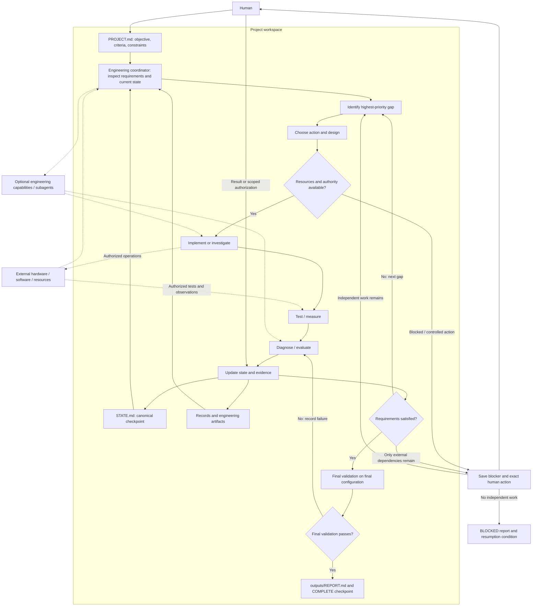

# Autonomous engineering architecture

The engineering coordinator is the active agent's role. It selects each action
from the gap between requirements and observed reality, rather than following a
fixed implementation sequence. The project workspace carries memory across agents.

The authority/resource gate applies to **every** external action in implementation
and testing, and is checked again when conditions change. A blocked request does
not prevent independent local work. Human results re-enter the evidence/state
loop; they do not bypass validation. A final-validation failure also returns to
diagnosis and the gap loop. BLOCKED preserves a handoff, not a success claim.

Human intent lives in PROJECT.md. STATE.md points to current artifacts, test
methods, and evidence; records preserve reproducible observations and decisions.
The report describes the engineered system, configuration, demonstrated results,
and operation. Optional specialists return bounded artifacts and evidence to the
coordinator, which maintains the single canonical state.
