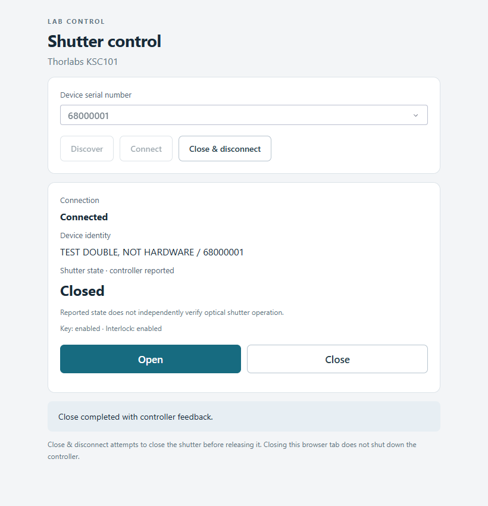
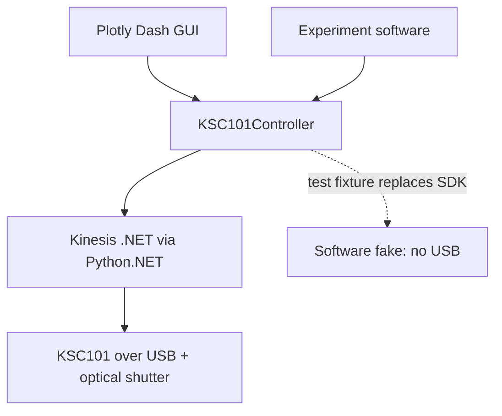

# thorlabs-shutter-control

Python controller and local Plotly Dash GUI for a Thorlabs KSC101 K-Cube Solenoid Controller and optical shutter.

Operate a shutter from the browser or integrate the same small Python API into
experiment software. The controller handles vendor calls, feedback and cleanup.

**Software-tested; awaiting physical validation.** The engineering checkpoint is
**AWAITING_HUMAN_REVIEW**; physical discovery, motion, feedback and shutdown
acceptance remain blocked. See [current state](STATE.md).



*Actual GUI in simulation. `68000001` is a fictional test identity; no physical
controller or shutter was used. [GUI controls and more states](docs/gui.md).*

## Features

- Python API for discovery, device selection, connection, identity and status.
- Manual Open/Close with reported-state checks and key/interlock checks before Open.
- Close attempts during normal disconnect, context-manager exit and GUI server shutdown.
- Local Dash controls and a [simulated demo](docs/getting-started.md#try-simulation) for use without hardware.
- Locked `uv` environment, pytest tests, Ruff checks, and package builds.

## Quick start — no hardware needed

Use Git, [uv](https://docs.astral.sh/uv/getting-started/installation/), and a modern
browser. The verified environment is Windows x64 with Python 3.12; `uv` uses the
repository's Python version file. Kinesis is unnecessary for the simulation demo.

Run in PowerShell:

```powershell
git clone https://github.com/cct1123/thorlabs-shutter-control.git
cd thorlabs-shutter-control
uv sync --locked
uv run --locked pytest -q -p no:cacheprovider --ignore=tests/test_sdk.py
uv run --locked python docs/examples/simulated_demo.py --api
uv run --locked python docs/examples/simulated_demo.py
```

The test command runs **49 software tests** and explicitly excludes real USB
enumeration. The API demo prints `closed → open → closed → disconnected`.
The final command starts the actual GUI at [localhost:8050](http://127.0.0.1:8050).
Click **Discover → Connect**, verify **TEST DOUBLE, NOT HARDWARE**, then try
**Open**, **Close**, and **Close & disconnect**. Stop the server with **Ctrl+C**.

The demo reuses `tests/conftest.py`; it needs a source checkout and dev dependencies.
There is no production `--simulate` flag or installed simulation backend.
[Fresh-install walkthrough and troubleshooting](docs/getting-started.md).

## Architecture



The API and KSC101 implementation share `controller.py`. Tests and the demo
replace its SDK boundary with a software fake. See the
[software architecture and repository map](docs/architecture.md).

## Python API

For an **approved, verified hardware setup**, with exactly one KSC101 attached:

```python
from thorlabs_shutter_control import KSC101Controller

with KSC101Controller() as controller:
    print(controller.identify_device())
    print(controller.get_status().shutter_state)
    controller.open_shutter()
    controller.close_shutter()
# Context exit attempts Close, stops polling, and disconnects.
```

This example can actuate real hardware. Start with the simulated API command above.
See [arguments, returns, errors, cleanup and integration](docs/python-api.md).

## Hardware operation

The target is a **KSC101 + compatible Thorlabs shutter + supported power supply +
USB-connected Windows computer**. The exact shutter, supply, serial and firmware
have not been established; there is no physically validated bench configuration.

Real control requires 64-bit Kinesis, its runtime/USB drivers and .NET Framework,
installed separately from `uv`. After bench checks and launch approval in the
[ordered hardware procedure](docs/HARDWARE_VALIDATION.md):

```powershell
uv run --locked shutter-control --list
uv run --locked shutter-control
```

`--list` enumerates real USB devices. GUI startup alone is passive; **Discover**
and **Connect** access hardware. The [hardware guide](docs/hardware.md) explains
configuration, official references and the pending validation.

**Shutdown is a best-effort Close and release.** Closing the browser tab does not
shut down the controller. USB loss, power loss, a hung vendor call or forced process
termination cannot guarantee closure. Displayed state is controller feedback,
not independent optical verification.

## Testing

```powershell
uv run --locked ruff check src tests docs/examples
uv run --locked ruff format --check src tests docs/examples
uv build
```

Tests cover operation, selection, faults, feedback disagreement, cleanup, CLI and
Dash callbacks. Simulation cannot validate wiring, motion, timing or interlocks.
See [validation evidence](records/RECORDS.md#e009); hardware REQ-003–008 remain **BLOCKED**.

## Documentation

| Start here | What you will find |
| --- | --- |
| [Getting started](docs/getting-started.md) | Installation, simulation, run commands and first-run problems |
| [GUI guide](docs/gui.md) | Controls, screenshots, status and shutdown workflow |
| [Python API and integration](docs/python-api.md) | Public interface, examples, state and ownership |
| [Software architecture](docs/architecture.md) | Data/control flow, simulation boundary and source map |
| [Hardware and validation](docs/hardware.md) | Target setup, vendor links, missing photos and physical limits |
| [Interface notes](docs/INTERFACE.md) | Kinesis members and historical SDK evidence |
| [Engineering report](outputs/REPORT.md) | Simplification, validation results and retained boundaries |

Maintainers: [PROJECT.md](PROJECT.md) holds intent, [STATE.md](STATE.md) holds the
checkpoint, and [records](records/RECORDS.md) hold evidence. Follow
[AGENTS.md](AGENTS.md) for engineering work. No license file is currently provided.
