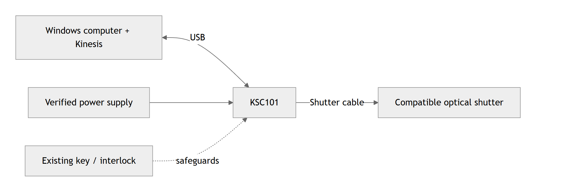

# Thorlabs shutter control

Use a **Thorlabs KSC101** to open and close a compatible optical shutter from a
local browser window or Python. The GUI shows device identity, connection status,
controller-reported shutter state, and errors.

**Lab workflow:** Install → Check the bench → Discover → Connect → Open / Close → Shut down.

## Current status

| Part | Status |
| --- | --- |
| Python controller and GUI | Implemented; **49 software tests pass**. [Software evidence](records/RECORDS.md#e011). |
| Real hardware | **Physical validation pending.** Connection, motion, feedback, recovery, and shutdown have not passed bench acceptance. |

The current hardware status is **AWAITING_HUMAN_REVIEW**. Before first device
access, approve and follow the [ordered hardware procedure](docs/HARDWARE_VALIDATION.md).
The guide below explains setup and operation; it does not replace those first-use checks.

## 1. Install and check the software

Use **Windows x64 with Python 3.12 x64**, the software-tested configuration.
Install [Git](https://git-scm.com/downloads),
[uv](https://docs.astral.sh/uv/getting-started/installation/), and
[Thorlabs Kinesis x64](https://www.thorlabs.com/software-pages/Motion_Control),
including the vendor runtime dependencies and USB drivers. The hardware backend
uses .NET Framework; `uv` installs only the Python dependencies.

In **PowerShell**:

```powershell
git clone https://github.com/cct1123/thorlabs-shutter-control.git
cd thorlabs-shutter-control
uv sync --locked
uv run --locked pytest -q -p no:cacheprovider --ignore=tests/test_sdk.py
```

Expect **49 passed**; resolve any failures before continuing. This check does not
access hardware. `uv` selects Python 3.12 and manages the environment; no manual
activation is needed. Already have
the checkout? Start at `uv sync --locked` in its folder.

The default Kinesis folder is `C:\Program Files\Thorlabs\Kinesis`. If yours differs,
set it in the same terminal before running the application:

```powershell
$env:KINESIS_DIR = Read-Host 'Full path to your installed Kinesis folder'
```

## 2. Prepare the bench



*Connection overview, not a pinout. Follow the actual equipment manuals and
[hardware setup notes](docs/hardware.md) for cabling and power-up.
[Editable diagram source](docs/assets/hardware-connections.mmd).*

| Check | What to establish |
| --- | --- |
| Controller and shutter | Actual KSC101 serial/firmware, shutter model, compatibility, initial state, and approved dwell/duty-cycle limits. |
| Power and cabling | Correct supply rating/polarity, shutter cable, and USB connection. Power down before changing shutter/interlock cabling; do not hot-plug the supply. |
| Protection and observation | Disable or independently block the beam source. Preserve the key/interlock arrangement; define how to observe motion safely and physically shut down. |
| Device ownership | Stop the simulator and close the Kinesis control GUI or other applications using this controller. Use one operator and one control process. |

The actual shutter model, supply, serial, firmware, and operating limits remain
unverified in this project. Record them during the procedure's **stage 0**.

## 3. Find your controller and launch the GUI

At the **approved discovery stage**, run:

```powershell
uv run --locked shutter-control --list
```

This loads Kinesis and enumerates USB identities without connecting or commanding
an output. Match the returned serial to the physical controller label. If none
appear, stop and use [troubleshooting](#troubleshooting).

**First use:** complete the procedure's passive connection, first Close,
Open/Close, and shutdown checks (stages 2–5) before its GUI stage. Once those
checks pass, select the actual serial (eight digits beginning with `68`) and launch:

```powershell
$env:KSC101_SERIAL = Read-Host 'KSC101 serial matching discovery and the label'
uv run --locked shutter-control --serial $env:KSC101_SERIAL
```

Keep the terminal open and visit [localhost:8050](http://127.0.0.1:8050).
The serial is preselected; the application does **not** auto-connect.

## 4. Open, close, and finish a session

Use this workflow at the approved GUI stage, or for an already validated bench:

| Step | In the GUI | What to check |
| --- | --- | --- |
| 1. Connect | Click **Connect**. To choose another device first, click **Discover** and select its serial. | Connection says **Connected**; identity matches the physical controller. |
| 2. Establish Closed | Click **Close**. | Reported **Closed** agrees with an independent observation. Stop if it does not. |
| 3. Open | Check the key/interlock reports, then click **Open**. | Observe the physical opening; keep within the approved operating/dwell limits. |
| 4. Close | Click **Close**. | Observe physical closure and compare with reported **Closed**. |
| 5. Finish | Click **Close & disconnect**, check the result, then press **Ctrl+C** in the terminal. | Verify physical closure, **Disconnected**, and server exit. |


*The actual application UI, shown with a software test fixture. `68000001` and
**TEST DOUBLE, NOT HARDWARE** are fictional demo identity values. Real operation
must show your controller's identity. [Full GUI guide](docs/gui.md).*

## Safety and operating limits

- **Reported state is not optical proof.** Independently verify closure; never
  look into a beam. Keep an independent beam block or disabled source during validation.
- **Shutdown is best effort.** Closing the browser tab leaves the controller
  running. USB/power loss, forced termination, or a hung vendor call can prevent
  closure. On an error or uncertain state, use the approved physical shutdown method.
- **Preserve safeguards.** Open requires a healthy connection and enabled
  key/interlock reports. Do not bypass them or use this software as the sole beam barrier.
- **Manual operation changes mode.** Open/Close select Manual mode; cleanup does
  not restore prior timed/triggered operation. Physical timing and duty-cycle
  limits are unvalidated; software timeouts do not provide precise exposure timing.

## Troubleshooting

| Symptom | Next step |
| --- | --- |
| `Kinesis SDK not found` / `Cannot load Kinesis` | Check `KINESIS_DIR`, matching Python/SDK bitness, .NET Framework, and vendor dependencies. Restart Python after changes. |
| `No KSC101 devices discovered` / `found 0` | Check the approved power/cabling arrangement and vendor USB-driver installation. Do not proceed to Open. |
| Wrong device or multiple controllers | Match discovery to the bench label and select the intended serial with `--serial` or the GUI dropdown. |
| Open disabled while connected | Check key/interlock reports and any error message. Preserve safeguards; resolve the cause before operating. |
| Fault / Unknown, or Close/shutdown error | Establish a safe physical state using the bench procedure. Resolve the cause before disconnect/reconnect; a repeated button press does not prove closure. |
| Port 8050 in use | Stop the earlier server, or add `--port 8051` to the launch command and visit port 8051. |
| `uv` or `git` not recognized | Install the tool, reopen PowerShell, and check `PATH`. |

[More installation and troubleshooting help](docs/getting-started.md#troubleshooting).

## Optional: try the controls without hardware

After `uv sync --locked`, run:

```powershell
uv run --locked python docs/examples/simulated_demo.py
```

Open [localhost:8050](http://127.0.0.1:8050), click **Discover → Connect**, verify
**TEST DOUBLE, NOT HARDWARE**, then try Open, Close, and Close & disconnect.
Stop with **Ctrl+C** before launching the hardware application.

The demo needs the source checkout and dev dependencies. It never loads Kinesis
or accesses USB. Add `--api` for a terminal walkthrough or `--empty` for the
missing-device case. There is no `shutter-control --simulate` option.

## Python usage and developer notes

For an **approved, validated bench**, first use **Close & disconnect** and stop
the GUI server with **Ctrl+C** so it releases the controller. Save this as
`shutter_example.py` in the repository folder:

```python
import os

from thorlabs_shutter_control import KSC101Controller

with KSC101Controller(os.environ["KSC101_SERIAL"]) as controller:
    print(controller.identify_device())
    controller.close_shutter()
    input("Verify Closed and safeguards; press Enter to open: ")
    controller.open_shutter()
    input("Verify Open; press Enter to close within the approved hold time: ")
    controller.close_shutter()
# Context exit attempts Close and disconnect, including on an exception.
```

In the same terminal where you set `KSC101_SERIAL`, run:

```powershell
uv run --locked python shutter_example.py
```

This requests real motion. Observe the approved dwell/thermal limits yourself;
this interactive example does not enforce them. See the [Python API guide](docs/python-api.md)
for configuration, status, and error handling.

**Architecture:** GUI / Python caller → `KSC101Controller` → Kinesis .NET via
Python.NET → USB KSC101. [Source map and timing notes](docs/architecture.md).

For maintenance, run the software tests above and:

```powershell
uv run --locked ruff check src tests docs/examples
uv run --locked ruff format --check src tests docs/examples
uv build
```

[Hardware acceptance procedure](docs/HARDWARE_VALIDATION.md) · [Current state](STATE.md) ·
[Validation records](records/RECORDS.md) · [Engineering report](outputs/REPORT.md)

The package declares Python `>=3.11,<3.14`; only 3.12 is validated here. The real
backend requires Windows. No license file is currently provided.
