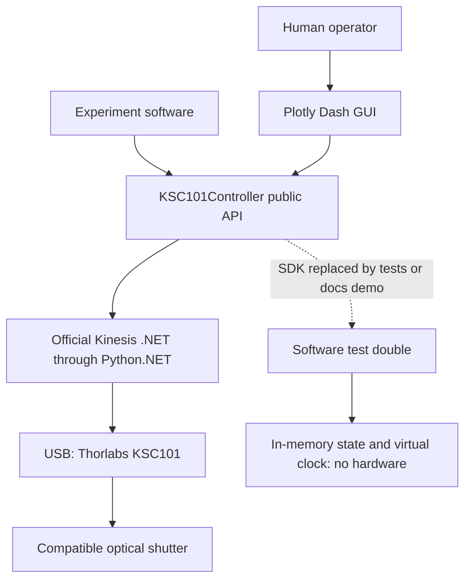

# Software architecture

[README](../README.md) · [Python API](python-api.md) · [Interface details](INTERFACE.md)

The project controls one KSC101 per controller instance. Experiment code and the
Dash GUI use `KSC101Controller`; vendor types, state enums, DLL loading and
cleanup logic stay inside `controller.py`.

The hardware and fake paths are alternatives. The Mermaid source above is editable.

## What each part owns

| Part | Responsibility |
| --- | --- |
| Experiment code | Decide when to request actions and manage the controller's lifetime |
| Dash GUI | Show status; translate button clicks to public controller calls; refresh every second |
| Controller | Validate inputs, select one device, serialize calls, check feedback, latch faults and attempt cleanup |
| Kinesis / Python.NET | Load vendor assemblies, communicate over USB, maintain polling/cache behavior |
| KSC101 and shutter | Physical operation; this repository has not yet validated their bench behavior |
| Test fixture | Replace the SDK with an in-memory fake and virtual time for software checks |

## Connection, commands and state

Construction, package import and the initial GUI page do not load the SDK or
connect a device. Discovery loads Kinesis lazily and filters type `68`. Connection
discovers again, initializes settings if needed, starts polling, reads identity,
and returns reported state. It issues no explicit output-enable, mode or state
writes; physical side effects of vendor initialization still await validation.

Commands check reported state; faults invalidate `ShutterStatus` and block Open
until disconnect/reconnect. Close and cleanup remain available while a handle
exists. See [the API reference](python-api.md#shutdown-and-faults) for recovery
semantics and [INTERFACE.md](INTERFACE.md) for the exact vendor command sequence.

Open preparation calls `close_shutter()` before enabling the output. Both commands
use one state wait that checks position, matching Active/Inactive state and Manual
mode; Open also requires enabled key/interlock feedback. There is no configurable
predicate or command-dispatch layer.

## Timing and ownership

- Default vendor polling interval: **250 ms**. GUI refresh: **1 s**.
- Default feedback timeout: **5 s per wait stage**, with two waits possible during Open.
  Native SDK calls may impose other waits; this is not an end-to-end deadline.
- One `RLock` serializes methods on an instance. It does not coordinate different
  instances, processes or vendor applications.
- The supplied CLI uses one process and a single-threaded local server, with debug
  and reloading disabled. Every browser tab shares that process's controller.
- No exposure timing, real-time synchronization or multi-user ownership service
  is implemented. Keep one operator and one owner per physical device.

## Simulation boundary

`tests/conftest.py` supplies `FakeDevice` and the `rig` fixture. It replaces
`_load_sdk` and the controller module's clock with in-memory equivalents. Setters
normally update simulated position immediately; tests inject failures, stuck
feedback and connection errors. The fixture uses a 0.5 s timeout and virtual waits.

The documentation demo applies that fixture, passes its controller to `create_app`
or the API walkthrough, and restores the patch after cleanup. It depends on test
internals and is not a public simulation API.

Simulation validates decisions and UI plumbing. It cannot demonstrate DLL/driver
compatibility, wiring, key/interlock electrical behavior, mechanics, feedback age,
thermal limits, USB-loss latency or physical shutdown.

## Repository map

| Path | Purpose |
| --- | --- |
| [controller.py](../src/thorlabs_shutter_control/controller.py) | Public controller/status/error types and real Kinesis implementation |
| [gui.py](../src/thorlabs_shutter_control/gui.py) | `create_app(controller)` and Dash layout/callbacks |
| [CLI entry point](../src/thorlabs_shutter_control/__main__.py) | `shutter-control` command and server shutdown |
| [assets/style.css](../src/thorlabs_shutter_control/assets/style.css) | Packaged GUI styling |
| [tests](../tests) | Controller, CLI, GUI and optional real-SDK tests |
| [pyproject.toml](../pyproject.toml), [uv.lock](../uv.lock) | Packaging and locked runtime/dev environment |
| [docs](.) | User guides, example harness and screenshots |
| [STATE.md](../STATE.md), [records](../records/RECORDS.md) | Checkpoint and traceable evidence |

Engineering operating instructions live in [AGENTS.md](../AGENTS.md).
