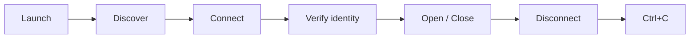
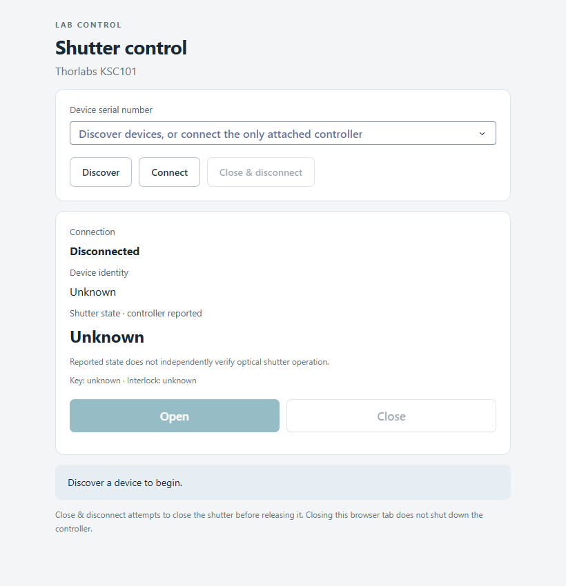
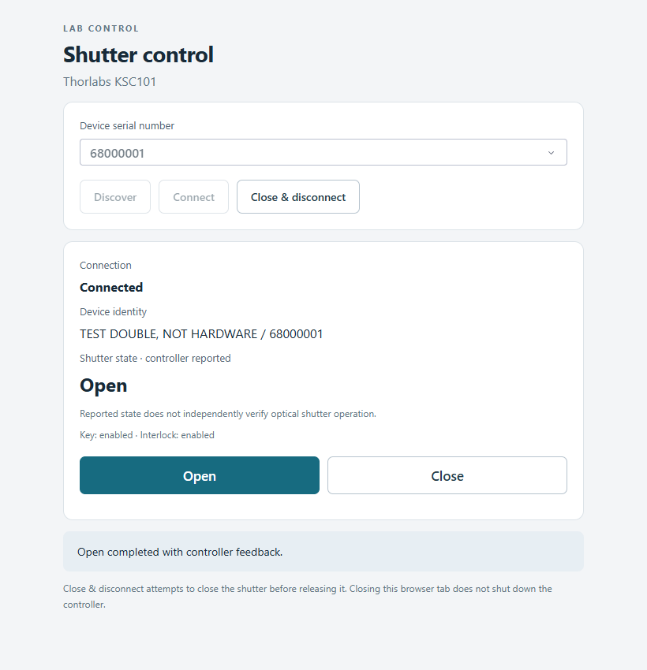
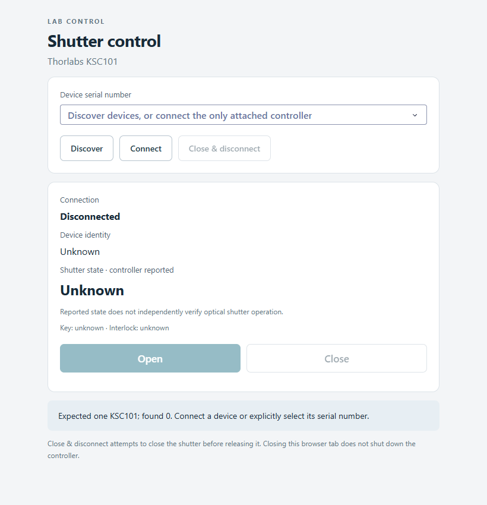

# Using the Dash GUI

[README](../README.md) · [Getting started](getting-started.md) · [Python API](python-api.md)

## Launch

For a source-checkout simulation, after `uv sync --locked`:

```powershell
uv run --locked python docs/examples/simulated_demo.py
```

Open [localhost:8050](http://127.0.0.1:8050). The terminal stays running while you
use the browser. On an approved hardware setup, `uv run --locked shutter-control`
launches the hardware application instead; follow the
[hardware procedure](HARDWARE_VALIDATION.md) before Discover, Connect or actuation.
Neither launcher connects automatically.

## Read the controls


*Actual Dash page after simulated Discover, Connect and Close. The test identity
`68000001` and description **TEST DOUBLE, NOT HARDWARE** identify software simulation.
The screenshot is not physical-device evidence.*

| Control or readout | What it does |
| --- | --- |
| **Device serial number** | Selects an identity returned by Discover, or preselected with the hardware CLI's `--serial`. Disabled while a device handle is retained. |
| **Discover** | Lists available KSC101 identities. Auto-selects the only result, or preserves a still-valid selection. A real-backend discovery accesses USB. |
| **Connect** | Connects the selected identity, or the sole discovered device. Reports ambiguity/missing-device errors. Does not issue explicit output/enable/mode writes. |
| **Connection** | Text indicator: Disconnected, Connected or Fault. Fault can coexist with a retained handle that still needs cleanup. |
| **Device identity** | Vendor description and selected serial. The description is cleared on release; the selected serial can remain visible. |
| **Shutter state · controller reported** | Open, Closed or Unknown. It is not independent verification of the blade or beam. |
| **Key / Interlock** | Enabled, not enabled or unknown from controller reports. These are status readouts, not switches to bypass safeguards. |
| **Open** | Requests manual opening. Enabled only for a healthy connection with key and interlock reported enabled. Remains available when already open. |
| **Close** | Requests closure. Available whenever a handle exists, including in a fault state; success is not guaranteed. |
| **Close & disconnect** | Attempts Close, stops polling and releases the device. Any failure is reported even though release is still attempted. |
| **Message area** | Shows the latest action result or error. A latched controller fault takes precedence. Ordinary refresh does not erase the last action message. |

Status refreshes once per second when callbacks can run. The supplied server is
single-threaded; a blocking operation can delay updates. All browser tabs share
one controller, so use one operator rather than independent tabs as separate owners.

## Normal workflow



In simulation, verify the test-double identity. With hardware, compare the actual
serial with the bench label and follow the ordered approval/observation gates.
Commands and status come through the same Python controller in both cases.

### Before connection



*Fresh simulated launch, before discovery. This screen alone does not mean that
zero devices exist: discovery has not run. The real application's initial page
is similarly passive and can load even without Kinesis installed.*

### Open



*After Open in simulation. The message confirms controller feedback from the fake.
The normal fixture updates immediately; this does not measure physical travel time.*

### No-device error

After stopping the first demo, run:

```powershell
uv run --locked python docs/examples/simulated_demo.py --empty
```

Click Discover, then Connect:



*Actual error produced by simulated empty discovery. The UI remains Disconnected;
Open/Close stay disabled and Connect remains available. A no-device error is
different from a communication fault on an existing connection.*

For a communication fault, the GUI instead shows **Fault / Unknown**, disables
Open, and permits Close/cleanup while a handle exists. Consult the error and
[troubleshooting guide](getting-started.md#troubleshooting).

## Disconnect and exit

Use **Close & disconnect**, check the result, then **Ctrl+C** in the terminal.
The hardware CLI also attempts shutdown when its server exits normally or receives
Ctrl+C. Closing the browser tab does neither. If the process is forced closed,
power or USB is lost, or a vendor call hangs, software cannot guarantee closure.

A shutdown error must be resolved using the approved bench recovery method;
retrying a button is not independent evidence that the shutter is closed.
See [shutdown details](python-api.md#shutdown-and-faults) and
[screenshot provenance](assets/README.md).
