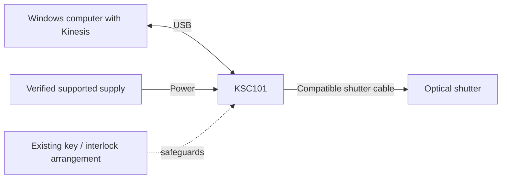
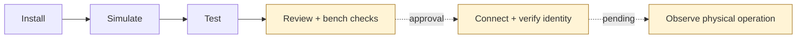

# Hardware and validation status

[README](../README.md) · [Setup](getting-started.md) · [Interface notes](INTERFACE.md)

The intended system is a Thorlabs KSC101 K-Cube Solenoid Controller, a compatible
Thorlabs optical shutter, a supported power supply and a USB-connected control
computer. **No physical configuration has yet passed acceptance.** The current
state is **AWAITING_HUMAN_REVIEW**, with REQ-003–008 blocked.

## What is established

| Item | Established evidence | Still required |
| --- | --- | --- |
| Controller | Human-supplied target: KSC101 | Actual identity/serial, firmware and availability |
| Optical shutter | Human-supplied compatible Thorlabs shutter | Exact model, compatibility, feedback capability and operating limits |
| Power and cables | A supply, shutter connection and USB link are required | Actual supply model/rating/polarity, cabling and approved power-up arrangement |
| Software | Windows x64 / Python 3.12 software tests; historical Kinesis 1.14.60.27990 SDK load and contract inspection | Installed vendor runtime/USB driver readiness on the bench computer |
| GUI and API | Software tests and actual browser operation against the test fixture | Physical motion, feedback, reconnect, faults and shutdown through the GUI/API |

Historical enumeration found zero devices ([E002](../records/RECORDS.md#e002)).
That is not a current device check or proof of a wiring/driver fault. No hardware
was accessed during the readiness audit or this documentation pass.

## Connection overview

This is a functional topology, **not a wiring diagram or pinout**. Supply, shutter,
trigger and interlock details must be checked against the actual equipment and
manufacturer instructions. The physical configuration is still unknown.

The [KSC101 manual, HA0368T Rev D](https://media.thorlabs.com/contentassets/e92d618c92c94cea9096b3f231859611/etn017648-d02.pdf)
is the project's recorded hardware reference: setup/interlocks in §§3.3–3.4,
operating modes in §4.3, specifications in Appendix C. The previously inspected
manual specifies a regulated 15 V supply rated 1 A; this does not identify or
validate the installed supply, connector polarity or shutter compatibility.
Use the actual model's manual before making connections. Preserve all existing
interlocks and follow the approved power-down procedure for cable changes.

## Vendor software

Install the official [Thorlabs Kinesis software](https://www.thorlabs.com/software-pages/Motion_Control)
appropriate to the Windows/Python bitness, including its runtime dependencies and
USB drivers. The controller explicitly loads .NET Framework through
[Python.NET](https://pythonnet.github.io/pythonnet/python.html).

The inspected SDK was **1.14.60.27990 x64**. Its administrative extraction is
ignored/local and absent from a fresh clone; it is not a USB-driver installation.

`uv sync` installs Python dependencies only. The loader expects the Kinesis folder
to contain DeviceManagerCLI, GenericMotorCLI and KCube.SolenoidCLI assemblies with
their vendor dependencies. Choose a nonstandard folder with `KINESIS_DIR` or
`--kinesis-dir`; restart Python before selecting a different SDK installation.
See [INTERFACE.md](INTERFACE.md) for the precise assembly names and vendor sources.

## From simulation to physical acceptance

The software path has been exercised. Every physical stage is still pending;
the diagram is an overview, not authorization or a substitute for the
[ordered validation procedure](HARDWARE_VALIDATION.md). That procedure starts
with bench facts and safeguards, then discovery and passive connection/identity/
release, first Close, individual Open/Close, shutdown/reconnect, GUI/Ctrl+C,
approved-dwell repetition, and closed-state USB-loss/recovery.

Acceptance needs independent observation, comparison with reported state, approved
operating/dwell limits and observed shutdown. No physical timing, optical transmission
or calibration result has been established.

## Shutdown and operating limits

Open/Close select Manual mode; successful Close reports Manual/Inactive and does
not restore the prior mode. The manual describes mode persistence across power
cycles. Initialization, polling and preparation feedback before Enable still need
bench validation. See [interface notes](INTERFACE.md) for the command sequence.

Normal cleanup attempts Close then release. Abrupt power/USB/process failure and
hung vendor calls cannot guarantee closure. Keep the independent beam block/source
disable, approved observation method and physical shutdown method required by
the hardware procedure. No firmware change or safeguard bypass is authorized.

## Hardware photographs

No project-owned or user-provided bench photos are available. No vendor imagery
has been copied into the repository; use the linked official manual for identification.
Future user-supplied photos would make this guide more useful:

| Photo to add | Useful caption content |
| --- | --- |
| Overall controller/shutter setup | Identify the KSC101, actual shutter, USB link and supported supply; show cable routing |
| Controller connections with power off | Identify shutter, power and USB connections without implying an unverified pinout |
| Shutter model label and mounting | Establish the actual model/orientation; omit private inventory or serial information where needed |

Add captions and record the verified configuration when these photos become available.
